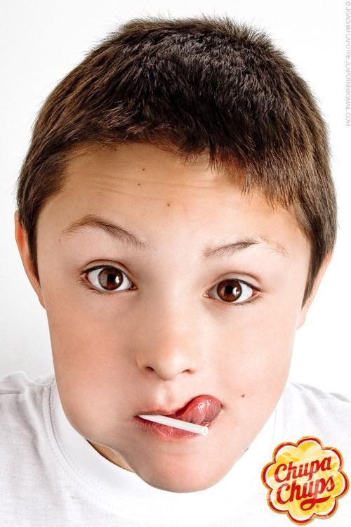
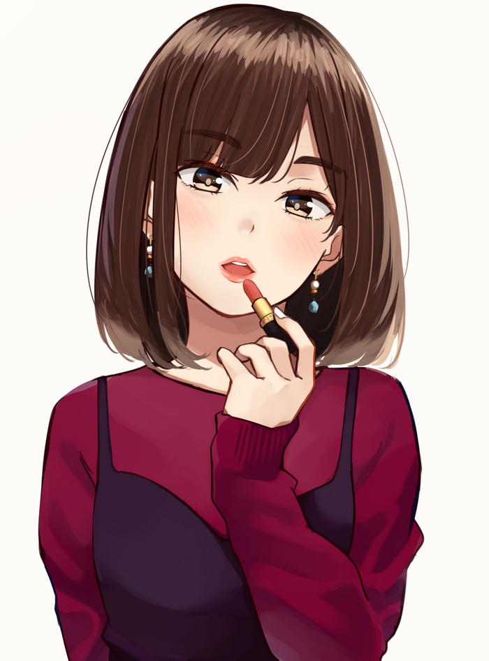
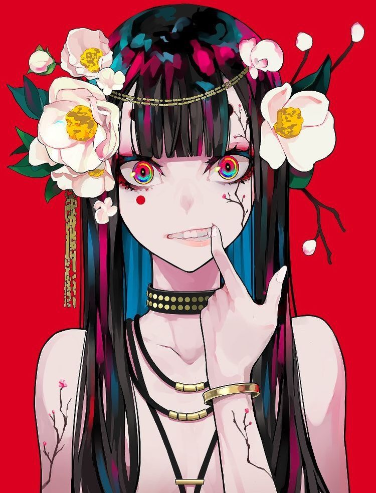
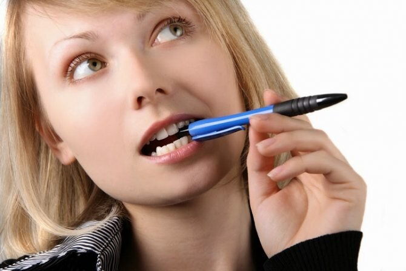

## Датасет

Предложенный организаторами датасет показался нам слишком простым для поставленной задачи.
Например, в выборке негативных картинок (не курение) отсутствовали изображения:

- помады и макияжа губ
- зубочисток
- леденцов
- питьевых трубочек
- палочек для еды
- стилизованных рисунков

<table style="width: 75%; margin-left: auto; margin-right: auto">
    <tr>
        <td></td>
        <td></td>
        <td></td>
    </tr>
    <tr>
        <td colspan="2"></td>
        <td></td>
    </tr>
</table>

Поэтому мы решили расширить датасет.
В негативную выборку были добавлены изображения по запросам:

- грызть ручку
- люди на барбекю
- дрифт
- заводские трубы
- зубочистка во рту
- красит губы
- пить сок через трубочку
- поёт
- сосёт чупа-чупс
- и т.д.

Также был расширен набор изображений связанных с курением.
Общий размер собранного датасета превышает 60К картинок:

- Курение/сигареты: >15K
- Не курение: >45K

## Модель

Мы попробовали различные архитектуры:

- MobileNet V2
- MobileNet V3 Small
- MobileNet V3 Large
- EfficientNet B1
- EfficientNet B3
- EfficientNet B4
- EfficientNet V2 S

Мы остановились на модели <b><i>EfficientNet V2 S</i></b> предобученную на ImageNet,
так как она показала лучшее соотношение точности и скорости.
Последний модуль classifier был заменен на Fully-Connected
слой с одним выходным нейроном и сигмоидой.
Натренировали модель на собственном датасете из 60К картинок.
После мы сконвертировали модель с помощью Onnxruntime,
для удобного запуска на любом языке программирования.
На локальной машине мы добились результатов обработки одной картинки за 80мс.

Используемые параметры для обучения:

- **Batch-size**: 32
- **Learning-rate**: 0.001
- **Optimizer**: SGD
- **Loss**: Binary Cross-Entropy
